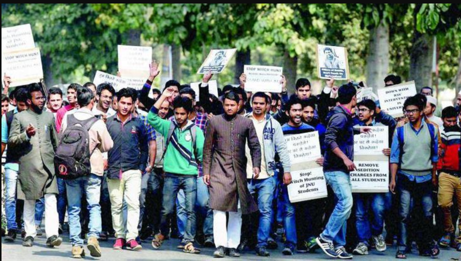

# Unemployment Rate In India

## Introduction:

This project explains how lock-down affected employment opportunities in **India** and how the unemployment rate increased during the Covid-19.

In this analysis, we will explore the trends and patterns of unemployment in India, examining the factors that contribute to unemployment and the impact of unemployment on different segments of the population. We will also use various data visualization techniques to present the findings in a clear and concise manner. 

## Problem Statement:

1.	What is the impact of the pandemic on employment in India?
2.	What are the regional variations in unemployment rates?
3.	How has the unemployment rate changed over time?
4.	How is the unemployment rate in urban areas compared to rural areas?

## Visualization:

This is a single page report, that is, the dashboard. This is the link to the dashboard https://app.powerbi.com/groups/me/reports/d7372c12-4383-40d0-a7f1-0936dd9538f4/ReportSection?experience=power-bi

## Analysis:

The dataset contains 740 rows and 7 columns. The analysis includes various visualizations to understand the unemployment rates in India. These include:

- Unemployment rate over time: The unemployment rate in India has fluctuated over time, with a general trend of increasing unemployment rates. A line graph showing the unemployment rate in India between 2019 and 2020.

- Regional variations in unemployment rates: There are significant regional variations in unemployment rates in India, with some regions having higher rates than others. The unemployment rate in urban areas is generally higher than that in rural areas.

- The pandemic on employment in India: The pandemic has had a significant impact on employment in India, with many people losing their jobs and facing challenges in finding new employment.

## Recommendations:

Use data visualization tools to present the data in a clear and intuitive manner, highlighting key trends and insights.

Perform advanced data analysis to identify patterns and correlations that can inform policy decisions and improve employment outcomes in India.

